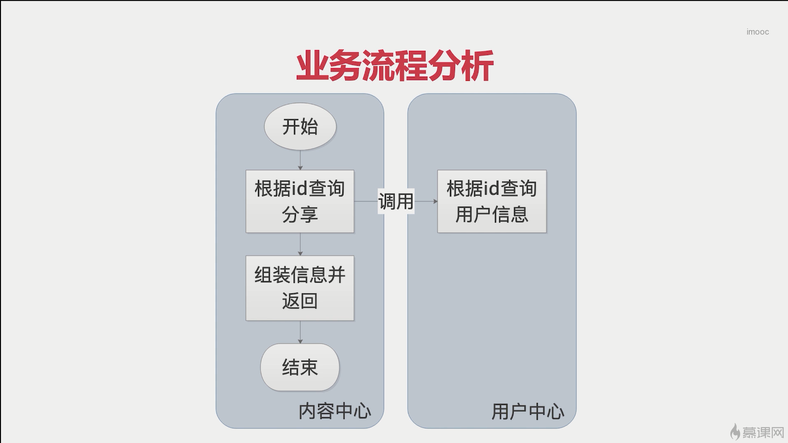
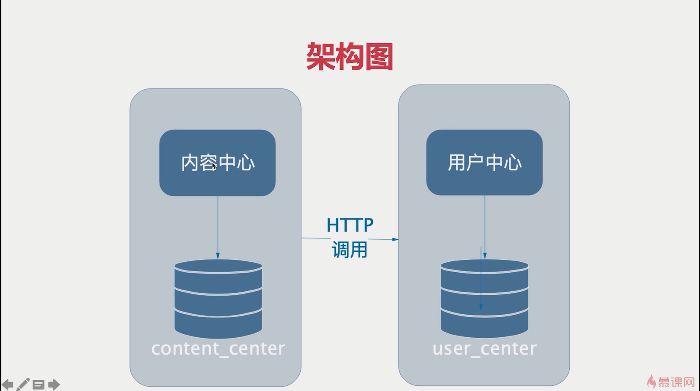
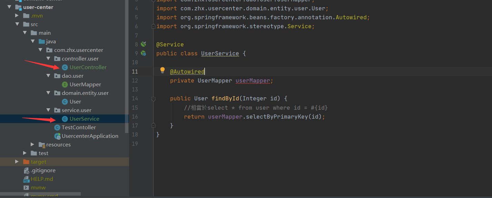

#### 1、实现如下



#### 2、一般实现



3、user-center添加如下



相关代码

```
@Service
public class UserService {

    @Autowired
    private UserMapper userMapper;

    public User findById(Integer id) {
        //相當於select * from user where id = #{id}
        return userMapper.selectByPrimaryKey(id);
    }
}

```

```
@RestController
@RequestMapping("/users")
public class UserController {

    @Autowired
    private UserService userService;

    @GetMapping("/{id}")
    public User findById(@PathVariable Integer id) {
        return userService.findById(id);
    }
}

```

