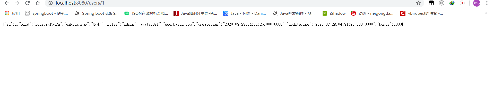

#### 1、实现如下


#### 2、一般实现


#### 3、user-center添加如下


相关代码

```
@Service
public class UserService {

    @Autowired
    private UserMapper userMapper;

    public User findById(Integer id) {
        //相當於select * from user where id = #{id}
        return userMapper.selectByPrimaryKey(id);
    }
}

```

```
@RestController
@RequestMapping("/users")
public class UserController {

    @Autowired
    private UserService userService;

    @GetMapping("/{id}")
    public User findById(@PathVariable Integer id) {
        return userService.findById(id);
    }
}

```

#### 4、测试



#### 5、编写content-center相关

```
    @Bean
    public RestTemplate restTemplate() {
        return new RestTemplate();
    }
```

```
    public ShareDTO findById(Integer id) {
        //获取分享详情
        Share share = shareMapper.selectByPrimaryKey(id);
        //发布人id
        Integer userId = share.getUserId();
//        RestTemplate restTemplate = new RestTemplate();
        //怎么样调用用户微服务的 users/id
        UserDTO userDTO = restTemplate.getForObject("http://localhost:8080/users/{id}", UserDTO.class, userId);
        //消息的装配
        ShareDTO shareDTO = new ShareDTO();
        BeanUtils.copyProperties(share, shareDTO);
        shareDTO.setWxNickname(userDTO.getWxNickname());
        return shareDTO;
    }

```

