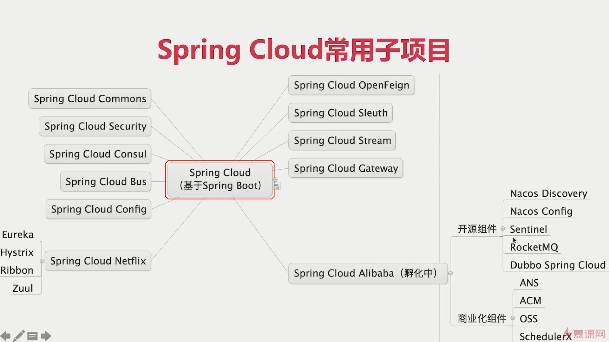
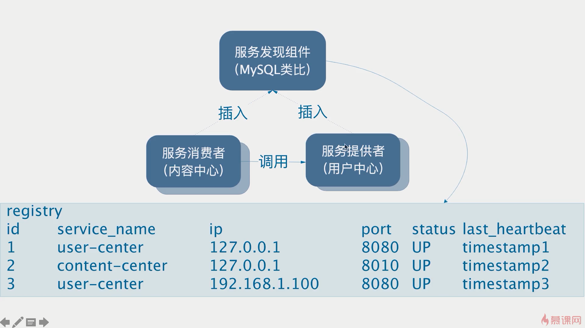
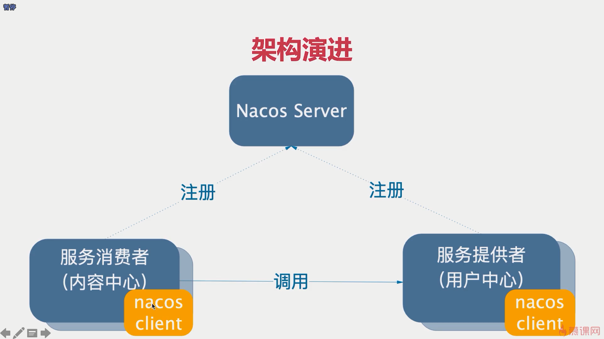
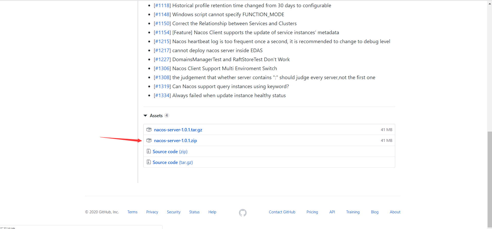
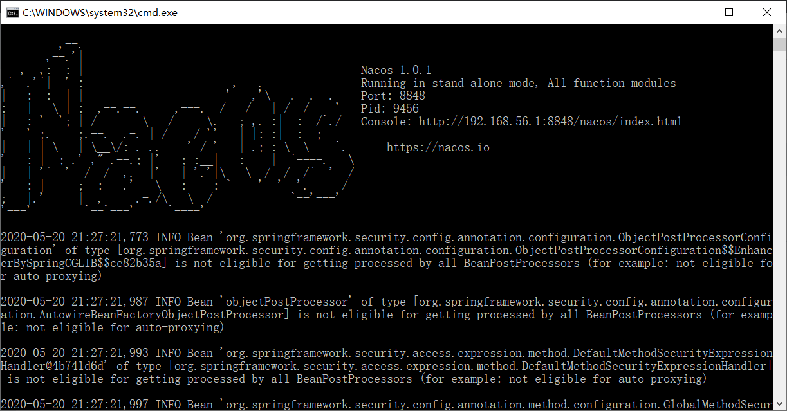
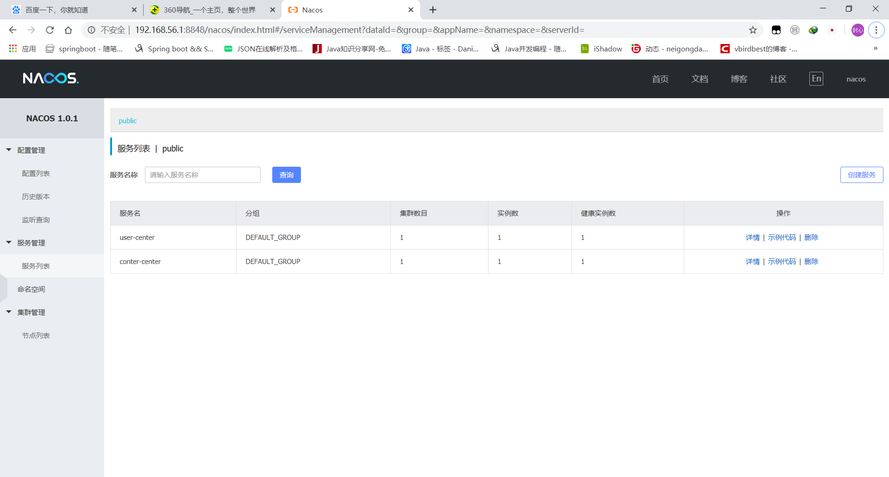
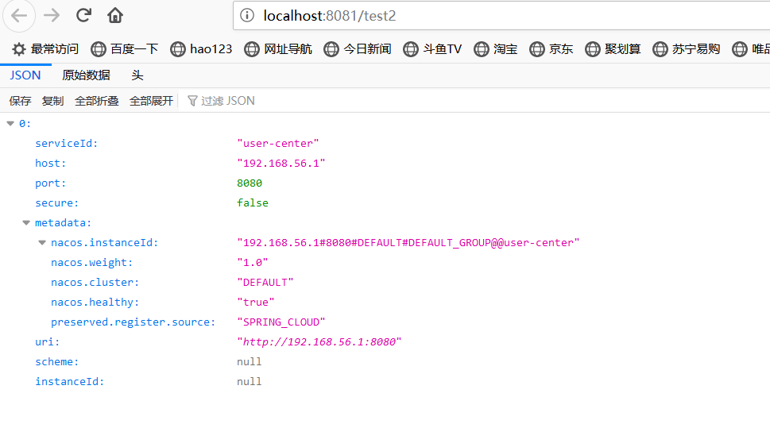

#                整合springcloudalibaba

##### springcloudalibaba常用子项目




## 一、添加依赖

```
    <dependencyManagement>
        <dependencies>
            <!--整合spring cloud-->
            <dependency>
                <groupId>org.springframework.cloud</groupId>
                <artifactId>spring-cloud-dependencies</artifactId>
                <version>Greenwich.SR1</version>
                <type>pom</type>
                <scope>import</scope>
            </dependency>
            <!--整合spring cloud alibaba-->
            <dependency>
                <groupId>org.springframework.cloud</groupId>
                <artifactId>spring-cloud-alibaba-dependencies</artifactId>
                <version>0.9.0.RELEASE</version>
                <type>pom</type>
                <scope>import</scope>
            </dependency>
        </dependencies>
    </dependencyManagement>
```

## 二、项目存在的问题

用户中心的地址发生变化，restTemplate地址就要修改，需要一套服务治理方案，引入注册中心





### 三、下载Nacous  Server并搭建

根据项目用的spring-cloud-alibaba版本选择Nacous  Server版本，咱们选择1.01版

下载地址 ：https://github.com/alibaba/nacos/releases/tag/1.0.1



解压，打开bin目录，windows选择startup.cmd双击启动

可以看出nacous也是个springboot项目，端口是8848



后台管理页面即为Console后面地址，例如我的92.168.56.1:8848/nacos/index.html

然后用户名密码默认都是nacous

#### 四、将用户中心（users-center）以及内容中心（content-center）注册到注册中心

1、引入依赖

```
        <dependency>
            <groupId>org.springframework.cloud</groupId>
            <artifactId>spring-cloud-alibaba-nacos-discovery</artifactId>
        </dependency>
```

2、加注解（不需要注解）

3、写配置

```
spring:
  datasource:
    url: jdbc:mysql://localhost:3306/content_center
    username: root
    password: root
      # >= 6.x: com.mysql.cj.jdbc.Driver
      # <= 5.x: com.mysql.jdbc.Driver
    driver-class-name: com.mysql.jdbc.Driver
  cloud:
    nacos:
      discovery:
        #指定nacous server地址
        server-addr: localhost:8848
  application:
    name: conter-center
server:
  port: 8081
```


观察到日志倒数第二行No service to register for nacos client...

这是由于没有配置 application. name原因，所以必须配置应用名，不然无法注册到注册中心



4、测试

```
    @Autowired
    private DiscoveryClient discoveryClient;
    
        /**
     * 测试 服务发现 证明内容中心总能找到用户中心
     * @return
     */
    @GetMapping("/test2")
    public List<ServiceInstance> discoveryClient() {
        //查詢指定服務的所有实例的信息
        return this.discoveryClient.getInstances("user-center");

    }
```



复制一份user-center代码，更改配置文件启动端口，重新开一个user-center服务，重新测试


注册中找到了两个user-center实例

五、改造restTempalte调用

```
    @Autowired
    private DiscoveryClient discoveryClient;

    public ShareDTO findById(Integer id) {
        //获取分享详情
        Share share = shareMapper.selectByPrimaryKey(id);
        //发布人id
        Integer userId = share.getUserId();
//        RestTemplate restTemplate = new RestTemplate();
        //怎么样调用用户微服务的 users/id
        List<ServiceInstance> instances = discoveryClient.getInstances("user-center");
        String targetURL = instances.stream()
                .map(instance -> instance.getUri().toString() + "/users/{id}")
                .findFirst()
                .orElseThrow(() -> new IllegalArgumentException("当前没有实例"));
        log.info("请求的目标地址{}" + targetURL);
        UserDTO userDTO = restTemplate.getForObject(targetURL, UserDTO.class, userId);
        //消息的装配
        ShareDTO shareDTO = new ShareDTO();
        BeanUtils.copyProperties(share, shareDTO);
        shareDTO.setWxNickname(userDTO.getWxNickname());
        return shareDTO;
    }
```

