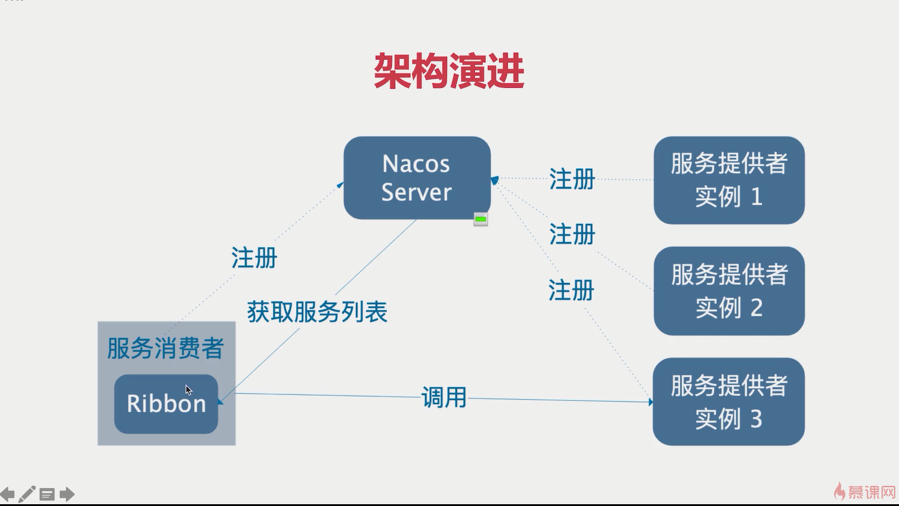
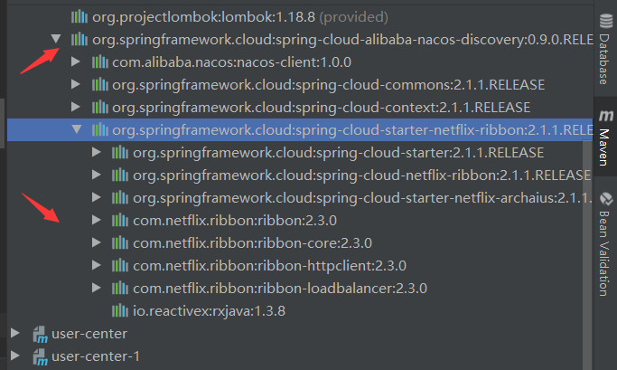
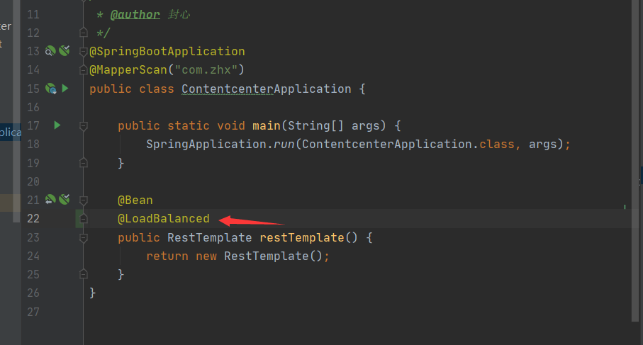
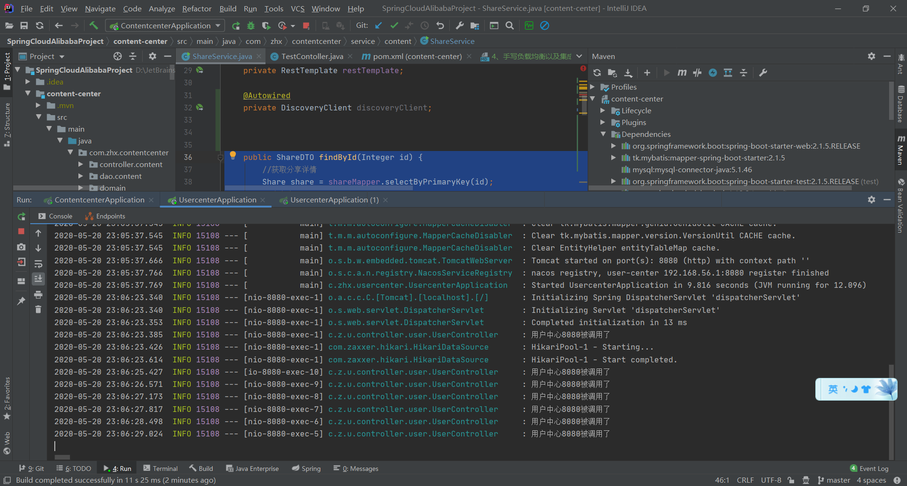
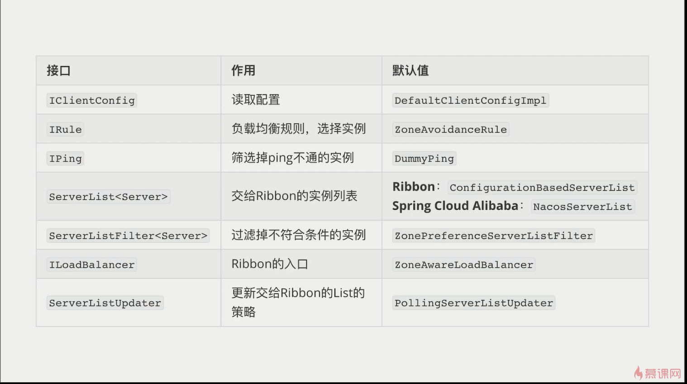
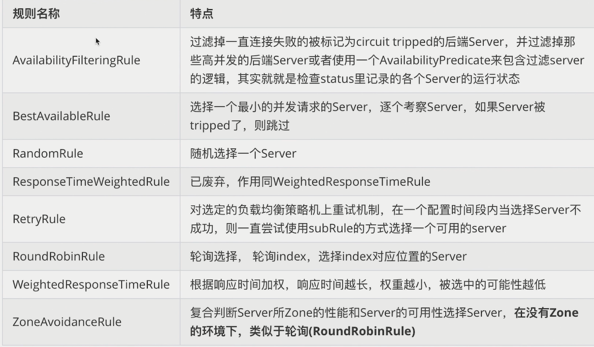
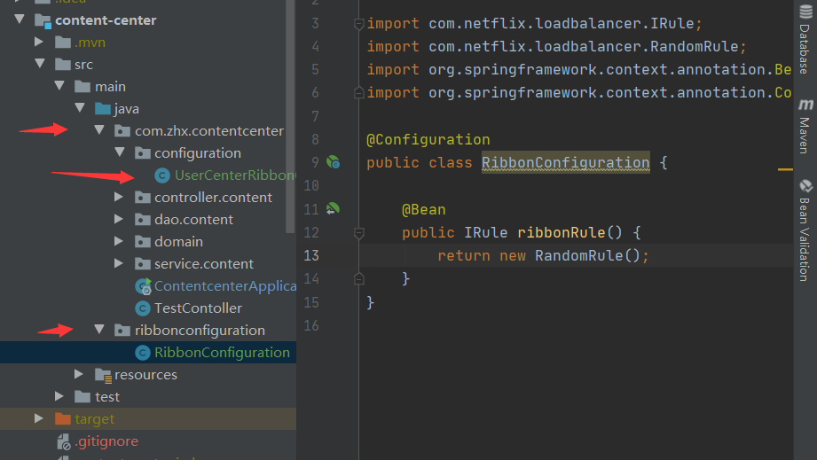

##                   手写负载均衡以及集成ribbon

#### 1、目前已经实现通过服务名调用，现在如何实现负载均衡（简单实现手写随机算法）

```
    @Autowired
    private DiscoveryClient discoveryClient;

    public ShareDTO findById(Integer id) {
        //获取分享详情
        Share share = shareMapper.selectByPrimaryKey(id);
        //发布人id
        Integer userId = share.getUserId();
//        RestTemplate restTemplate = new RestTemplate();
        //怎么样调用用户微服务的 users/id
        //所有用户中心的请求地址
        List<ServiceInstance> instances = discoveryClient.getInstances("user-center");
        List<String> targetURLS = instances.stream()
                .map(instance -> instance.getUri().toString() + "/users/{id}")
                .collect(Collectors.toList());
        int i = ThreadLocalRandom.current().nextInt(targetURLS.size());
        String url = targetURLS.get(i);
        log.info("请求的目标地址{}" + url);
        UserDTO userDTO = restTemplate.getForObject(url, UserDTO.class, userId);
        //消息的装配
        ShareDTO shareDTO = new ShareDTO();
        BeanUtils.copyProperties(share, shareDTO);
        shareDTO.setWxNickname(userDTO.getWxNickname());
        return shareDTO;
    }

```


#### 2、集成ribbon实现



1、引依赖（不用引spring-cloud-alibaba-nacos-discovery已经包含了）



2、写注解



3、改写代码

```
    public ShareDTO findById(Integer id) {
        //获取分享详情
        Share share = shareMapper.selectByPrimaryKey(id);
        //发布人id
        Integer userId = share.getUserId();
//        RestTemplate restTemplate = new RestTemplate();
        //怎么样调用用户微服务的 users/id
        UserDTO userDTO = restTemplate.getForObject("http://user-center/users/{id}", UserDTO.class, userId);
        //消息的装配
        ShareDTO shareDTO = new ShareDTO();
        BeanUtils.copyProperties(share, shareDTO);
        shareDTO.setWxNickname(userDTO.getWxNickname());
        return shareDTO;
    }
```




默认使用轮询的策略

#### 3、ribbon组件



#### 4、ribbon内置的负载均衡策略



5、細顆粒度配置ribbon

```
@RibbonClient(name = "user-center",configuration = RibbonConfiguration.class)
@Configuration
public class UserCenterRibbonConfiguration {
}

```

```
@Configuration
public class RibbonConfiguration {

    //随机策略
    @Bean
    public IRule ribbonRule() {
        return new RandomRule();
    }
}

```



注意：包结构，因为父子容器关系，RibbonConfiguration要与启动类上级目录（springboot启动类默认扫描启动类当前包以及子包），也可以采用yml配置文件配置（建议用配置类更灵活）