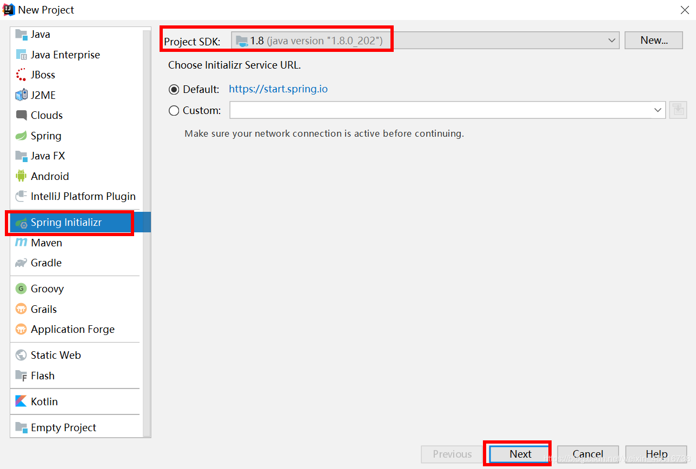
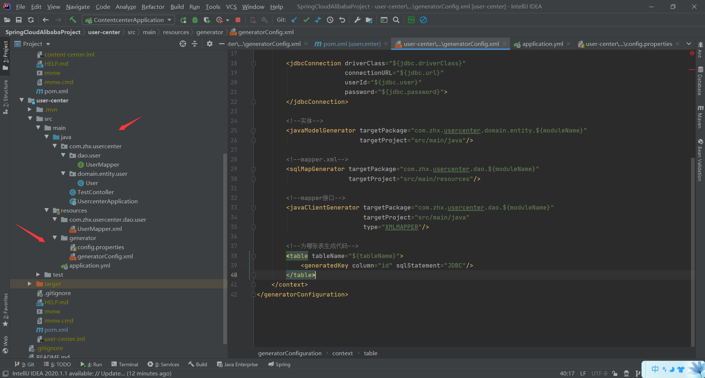
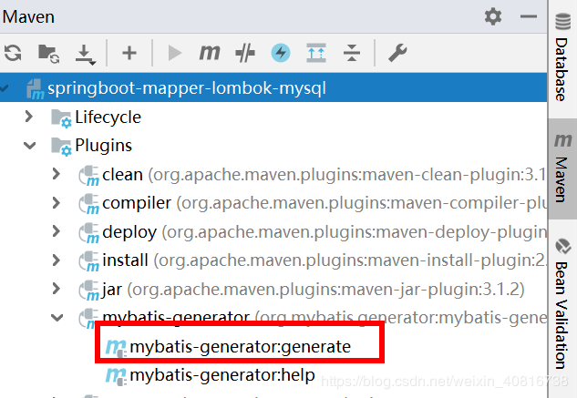
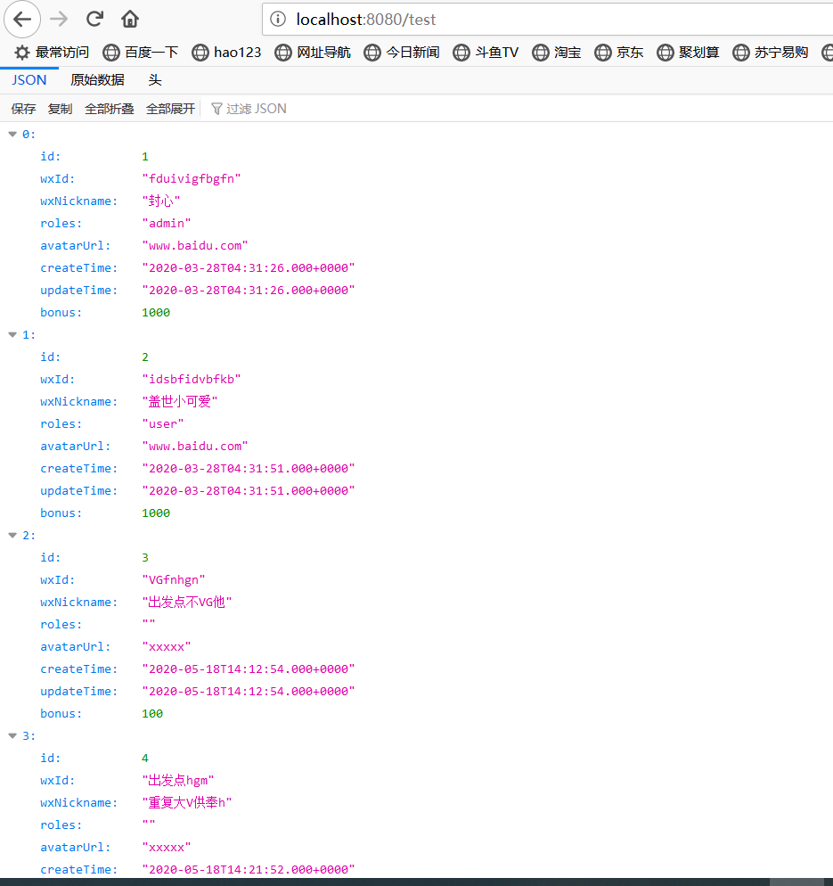

## Spring Cloud Alibaba整合通用Mapper+Lombok+Mysql

文章目录
一、使用Spring Initializr快速创建Spring Boot应用
二、相关依赖
	2.1. 添加依赖
	2.2. mybatis添加插件
	2.3. 在resources目录下面创建generator目录存放generatorConfig.xml
	2.3.1. config.properties配置文件
	2.3.2. lombok插件
	2.3.3. 数据库信息
	2.3.4. 代码生成实体类、mapper接口和mapper.xml
	2.3.5. 指定生成那些表
	2.4. config.properties配置文件
	2.4.1. 数据库信息
	2.4.2. 模块名称
	2.4.3. 表名
	2.5. 配置SpringBoot配置文件
	2.6. 运行数据库脚本
	2.7. 双击运行：
三、代码生成效果
	3.1. 实体类效果：
	3.2. mapper接口效果：
	3.3. mapper映射文件效果：
四、启动类添加注解
五、测试
六、调用服务截图

### 一、使用Spring Initializr快速创建Spring Boot应用





## 二、相关依赖

### 2.1. 添加依赖

```
    <dependencies>
        <dependency>
            <groupId>org.springframework.boot</groupId>
            <artifactId>spring-boot-starter-web</artifactId>
        </dependency>
        <dependency>
            <groupId>tk.mybatis</groupId>
            <artifactId>mapper-spring-boot-starter</artifactId>
            <version>2.1.5</version>
        </dependency>
        <dependency>
            <groupId>mysql</groupId>
            <artifactId>mysql-connector-java</artifactId>
            <version>5.1.46</version>
        </dependency>
        <dependency>
            <groupId>org.springframework.boot</groupId>
            <artifactId>spring-boot-starter-test</artifactId>
            <scope>test</scope>
        </dependency>
        <dependency>
            <groupId>org.projectlombok</groupId>
            <artifactId>lombok</artifactId>
            <version>1.18.8</version>
            <scope>provided</scope>
        </dependency>
    </dependencies>

    <dependencyManagement>
        <dependencies>
            <!--整合spring cloud-->
            <dependency>
                <groupId>org.springframework.cloud</groupId>
                <artifactId>spring-cloud-dependencies</artifactId>
                <version>Greenwich.SR1</version>
                <type>pom</type>
                <scope>import</scope>
            </dependency>
            <!--整合spring cloud alibaba-->
            <dependency>
                <groupId>org.springframework.cloud</groupId>
                <artifactId>spring-cloud-alibaba-dependencies</artifactId>
                <version>0.9.0.RELEASE</version>
                <type>pom</type>
                <scope>import</scope>
            </dependency>
        </dependencies>
    </dependencyManagement>
```

### 2.2. mybatis添加插件

```
 <build>
        <plugins>
            <plugin>
                <groupId>org.springframework.boot</groupId>
                <artifactId>spring-boot-maven-plugin</artifactId>
            </plugin>
            <plugin>
                <groupId>org.mybatis.generator</groupId>
                <artifactId>mybatis-generator-maven-plugin</artifactId>
                <version>1.3.6</version>
                <configuration>
                    <configurationFile>
                        ${basedir}/src/main/resources/generator/generatorConfig.xml
                    </configurationFile>
                    <overwrite>true</overwrite>
                    <verbose>true</verbose>
                </configuration>
                <dependencies>
                    <dependency>
                        <groupId>mysql</groupId>
                        <artifactId>mysql-connector-java</artifactId>
                        <version>5.1.46</version>
                    </dependency>
                    <dependency>
                        <groupId>tk.mybatis</groupId>
                        <artifactId>mapper</artifactId>
                        <version>4.1.5</version>
                    </dependency>
                </dependencies>
            </plugin>
        </plugins>
    </build>
```

### 2.3. 在resources目录下面创建generator目录存放generatorConfig.xml

涉及以下5部分：

#### 2.3.1. config.properties配置文件

#### 2.3.2. lombok插件

#### 2.3.3. 数据库信息

#### 2.3.4. 代码生成实体类、mapper接口和mapper.xml

#### 2.3.5. 指定生成那些表

#### generatorConfig.xml文件内容如下：

```
<!DOCTYPE generatorConfiguration
    PUBLIC "-//mybatis.org//DTD MyBatis Generator Configuration 1.0//EN"
    "http://mybatis.org/dtd/mybatis-generator-config_1_0.dtd">

<generatorConfiguration>
    <properties resource="generator/config.properties"/>

    <context id="Mysql" targetRuntime="MyBatis3Simple" defaultModelType="flat">
        <property name="beginningDelimiter" value="`"/>
        <property name="endingDelimiter" value="`"/>

        <plugin type="tk.mybatis.mapper.generator.MapperPlugin">
            <property name="mappers" value="tk.mybatis.mapper.common.Mapper"/>
            <property name="caseSensitive" value="true"/>
            <property name="lombok" value="Getter,Setter,ToString"/>
        </plugin>

        <jdbcConnection driverClass="${jdbc.driverClass}"
                        connectionURL="${jdbc.url}"
                        userId="${jdbc.user}"
                        password="${jdbc.password}">
        </jdbcConnection>

        <!--实体-->
        <javaModelGenerator targetPackage="com.zhx.usercenter.domain.entity.${moduleName}"
                            targetProject="src/main/java"/>

        <!--mapper.xml-->
        <sqlMapGenerator targetPackage="com.zhx.usercenter.dao.${moduleName}"
                         targetProject="src/main/resources"/>

        <!--mapper接口-->
        <javaClientGenerator targetPackage="com.zhx.usercenter.dao.${moduleName}"
                             targetProject="src/main/java"
                             type="XMLMAPPER"/>

        <!--为哪张表生成代码-->
        <table tableName="${tableName}">
            <generatedKey column="id" sqlStatement="JDBC"/>
        </table>
    </context>
</generatorConfiguration>
```

#### 2.4. config.properties配置文件

涉及部分：

#### 2.4.1. 数据库信息

#### 2.4.2. 模块名称

#### 2.4.3. 表名

具体内容：

```
jdbc.driverClass=com.mysql.jdbc.Driver
jdbc.url=jdbc:mysql://localhost:3306/user_center?nullCatalogMeansCurrent=true
jdbc.user=root
jdbc.password=root

# \u6A21\u5757\u540D\u79F0
moduleName=user
# \u8868\u540D
tableName=user
```

#### 2.5. 配置SpringBoot配置文件

```
spring:
  datasource:
    url: jdbc:mysql://localhost:3306/user_center
    username: root
    password: root
    # >= 6.x: com.mysql.cj.jdbc.Driver
    # <= 5.x: com.mysql.jdbc.Driver 根据mysql驱动版本选择driver-class-name 我用的是5.1.46
    driver-class-name: com.mysql.jdbc.Driver
server:
  port: 8080
```

#### 2.6. 运行数据库脚本

```
USE `user_center`;

-- -----------------------------------------------------
-- Table `user`
-- -----------------------------------------------------
CREATE TABLE IF NOT EXISTS `user` (
  `id` INT NOT NULL AUTO_INCREMENT COMMENT 'Id',
  `wx_id` VARCHAR(64) NOT NULL DEFAULT '' COMMENT '微信id',
  `wx_nickname` VARCHAR(64) NOT NULL DEFAULT '' COMMENT '微信昵称',
  `roles` VARCHAR(100) NOT NULL DEFAULT '' COMMENT '角色',
  `avatar_url` VARCHAR(255) NOT NULL DEFAULT '' COMMENT '头像地址',
  `create_time` DATETIME NOT NULL COMMENT '创建时间',
  `update_time` DATETIME NOT NULL COMMENT '修改时间',
  `bonus` INT NOT NULL DEFAULT 300 COMMENT '积分',
  PRIMARY KEY (`id`))
COMMENT = '分享';


-- -----------------------------------------------------
-- Table `bonus_event_log`
-- -----------------------------------------------------
CREATE TABLE IF NOT EXISTS `bonus_event_log` (
  `id` INT NOT NULL AUTO_INCREMENT COMMENT 'Id',
  `user_id` INT NULL COMMENT 'user.id',
  `value` INT NULL COMMENT '积分操作值',
  `event` VARCHAR(20) NULL COMMENT '发生的事件',
  `create_time` DATETIME NULL COMMENT '创建时间',
  `description` VARCHAR(100) NULL COMMENT '描述',
  PRIMARY KEY (`id`),
  INDEX `fk_bonus_event_log_user1_idx` (`user_id` ASC) )
ENGINE = InnoDB
COMMENT = '积分变更记录表';
```

#### 2.7. 双击运行：




### 三、代码生成效果

#### 3.1. 实体类效果：

```
@Getter
@Setter
@ToString
@Table(name = "user")
public class User {
    /**
     * Id
     */
    @Id
    @GeneratedValue(generator = "JDBC")
    private Integer id;

    /**
     * 微信id
     */
    @Column(name = "wx_id")
    private String wxId;

    /**
     * 微信昵称
     */
    @Column(name = "wx_nickname")
    private String wxNickname;

    /**
     * 角色
     */
    private String roles;

    /**
     * 头像地址
     */
    @Column(name = "avatar_url")
    private String avatarUrl;

    /**
     * 创建时间
     */
    @Column(name = "create_time")
    private Date createTime;

    /**
     * 修改时间
     */
    @Column(name = "update_time")
    private Date updateTime;

    /**
     * 积分
     */
    private Integer bonus;
}
```

#### 3.2. mapper接口效果：

```
import com.zhx.usercenter.domain.entity.user.User;
import tk.mybatis.mapper.common.Mapper;

public interface UserMapper extends Mapper<User> {
}
```

#### 3.3. mapper映射文件效果：

```
<?xml version="1.0" encoding="UTF-8"?>
<!DOCTYPE mapper PUBLIC "-//mybatis.org//DTD Mapper 3.0//EN" "http://mybatis.org/dtd/mybatis-3-mapper.dtd">
<mapper namespace="com.zhx.usercenter.dao.user.UserMapper">
  <resultMap id="BaseResultMap" type="com.zhx.usercenter.domain.entity.user.User">
    <!--
      WARNING - @mbg.generated
    -->
    <id column="id" jdbcType="INTEGER" property="id" />
    <result column="wx_id" jdbcType="VARCHAR" property="wxId" />
    <result column="wx_nickname" jdbcType="VARCHAR" property="wxNickname" />
    <result column="roles" jdbcType="VARCHAR" property="roles" />
    <result column="avatar_url" jdbcType="VARCHAR" property="avatarUrl" />
    <result column="create_time" jdbcType="TIMESTAMP" property="createTime" />
    <result column="update_time" jdbcType="TIMESTAMP" property="updateTime" />
    <result column="bonus" jdbcType="INTEGER" property="bonus" />
  </resultMap>
</mapper>
```

#### 四、启动类添加注解

– 不然spring扫描不到，无法将mapper进行实例化，导致mapper接口无法注入

```
import org.springframework.boot.SpringApplication;
import org.springframework.boot.autoconfigure.SpringBootApplication;
import tk.mybatis.spring.annotation.MapperScan;

/**
 * @author 封心
 */
@SpringBootApplication
@MapperScan("com.zhx")
public class UsercenterApplication {

    public static void main(String[] args) {
        SpringApplication.run(UsercenterApplication.class, args);
    }

}

```

#### 五、测试

```
import com.zhx.usercenter.dao.user.UserMapper;
import com.zhx.usercenter.domain.entity.user.User;
import org.springframework.beans.factory.annotation.Autowired;
import org.springframework.web.bind.annotation.GetMapping;
import org.springframework.web.bind.annotation.RestController;

import java.util.Date;
import java.util.List;

/**
 * 测试mybatis是否好使
 */
@RestController
public class TestContoller {

    @Autowired
    private UserMapper userMapper;

    @GetMapping("/test")
    public List<User>  testInsert() {
        User user = new User();
        user.setAvatarUrl("xxxxx");
        user.setBonus(100);
        user.setCreateTime(new Date());
        user.setUpdateTime(new Date());
        this.userMapper.insertSelective(user);
        List<User> users = this.userMapper.selectAll();
        return users;
    }

}
```

#### 六、调用服务截图




